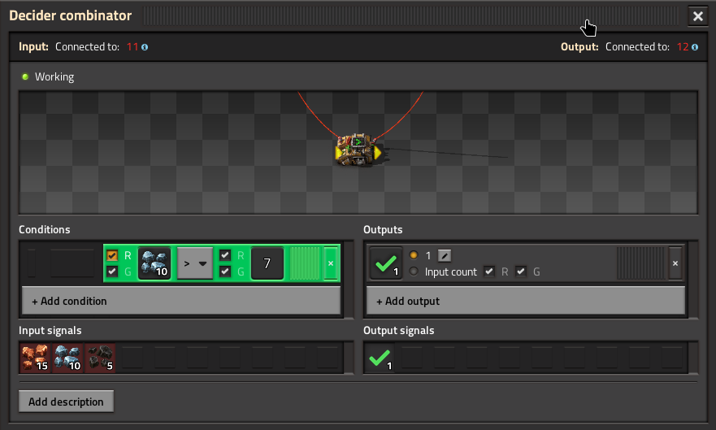
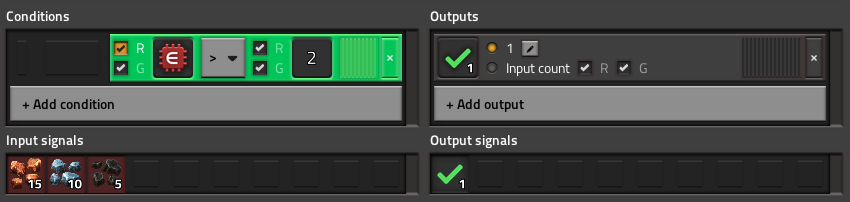
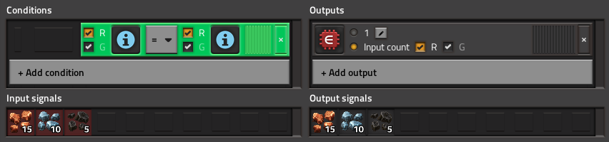
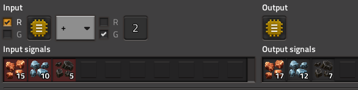

The constant combinator is output-only; it continuously outputs the signals configured on it to the attached circuit network.

However, the Decider Combinator, the Arithmetic Combinator and the Selector Combinator all take inputs from circuit networks in addition to producing outputs. In order to support reading from one network and writing to another, these combinators have to have both their input and output connections wired up to circuit networks.

> [!TIP]
> Use ALT-mode (by tapping <kbd>Alt</kbd>) or hover the mouse over the combinator to see the arrows that mark the input and output sides of the combinator.
## Decider Combinator

The decider combinator checks a configured list of **Conditions**, and if they are satisfied, outputs the configured **Outputs**

Some examples:

> If there is more than 7 iron ore, output 1 ✅

> If there is more than 7 iron ore, output how much coal there is.

When there is more than one condition, they can be combined with ANDs and ORs to do arbitrary boolean logic, similar to how train schedules work:

> (if iron-ore > 7 AND coal = 0) OR copper-ore = 15, output 1 ✅

The editor shows the order of operations visually to make it easier to remember, but `AND` has higher precedence than `OR`, which means the logical expressions are in [Disjunctive normal form](https://en.wikipedia.org/wiki/Disjunctive_normal_form), and therefore all boolean logic is possible, although sometimes very tedious to write out.

When there is more than one output, they are either all on (if the condition is met), or all off (if it isn't):

> if iron-ore > 7, output 1 ✅ and how much coal there is

The right hand side of a condition can be a constant, as shown above, but it can also be another signal:

> If there is more iron ore than there is coal

There are 3 special signals that can be used in decider combinators: **Everything**, **Each** and **Anything**.

When **Everything** is used in a condition, it causes the condition to be evaluated once for each input signal, and it only passes if all of them pass.

> If every input signal is greater than 2, output 1 ✅

> [!WARNING]
> Signals which have a value of 0 are ignored by **Everything**, **Each** and **Anything**, because 0 is treated the same as unset.

When used as an output, **Everything** outputs all the input signals (or a fixed amount of each input signal if the constant value is set):

> If coal > 2, output 1 of each input signal

> Always output all the inputs

When **Each** is used as a condition, it also evaluates once per input signal, but produces the outputs multiple times, once for each signal that passes the conditions.

> For each input > 9, output 1 ✅

**Each** can only be used as an output when it is also used in a condition, and outputs to whichever signal currently being evaluated.

> For each input > 9, output 1 of that signal.

When used as a condition **Anything** also evaluates once per input signal, but passes if any of those signals it passes the condition.

> If any input signal is greater than 9, output 1 ✅

When used as an output, it outputs just one signal from the input (the "first" signal):

> If anything > 9, output 1 of the first input signal.

> [!WARNING]
> First does not correspond to the order shown when viewing the circuit networks, which always sorts the signals by their value in descending order. Instead it seems to be an internal ordering which corresponds to the order seen in Factoriopedia.

When used as an output in combination with an **Each** condition, it instead outputs the first input signal which passed the conditions.

> Output 1 of the "first" signal > 9

When the combinator input is connected to both a red and a green wire, you can pick whether to read from red, green or both (summed together) both when reading signals for conditions and when outputting the input count or a signal.

> For each signal where there's more of that signal in the red circuit network than the green network, output 1 of that signal.

This can be used to construct a [Circuit Filter](designs/Circuit%20Filter.md):

> For each signal present in green, output how many there are in the red network

> [!NOTE]
> You can also connect red and green wires to the output, but combinators always output the same thing to both red and green networks.

The Decider combinator cannot, however move signal values from one signal to another, for that we need...
## Arithmetic Combinator

The arithmetic combinator serves two purposes; the more straightforward one is doing math

> `V = coal * 2`

But it is also incredibly useful just for translating one signal value into another:

> `V = copper * 1` aka `V = copper`

Just like the decider combinator, you can connect both red and green wires and select which network to use:

> `V = copper (from red) * copper (from green)`

You can also use **Each** to do math to all signals from a network:

> For each signal X, output X + 2 of that signal

## Selector Combinator

The selector combinator is somewhat of a grab bag of operations for interacting with signals at a more meta level.

It has 7 modes of operation which each do different things.

### Mode: Select Input

Selects one signal from the input network by index after sorting the signals by value.

Most commonly (and by default) it is used to select the biggest input from a circuit network:

Switching the sort order to ascending could instead give you the smallest input.

Changing the index to 1 could give you the second-biggest (or second-smallest)

The index can even be set by another signal to be able to programmatically iterate through the signals one-by-one.

### Mode: Count inputs

Counts how many signals are present in the input network. Mostly useful when trying to iterate through signals to know how many signals there are to iterate though.

> [!NOTE]
> You could actually also do this with a decider combinator set to "for **Each** != 0, output 1 C", although The decider combinator is probably easier to read.

### Mode: Random input

Randomly flickers through signals one at a time. Mostly useful when trying to set the filters of an inserter with more than the max of 5 filters. While using randomness to solve that is somewhat crude, it is very simple to set up, and works well in practice.

### Mode: Stack size

Outputs the stack size of all the input signals to the output, disregarding the input signal value.

Useful when trying to compute how many stacks of something you have, but also for filtering signals to just items (since recipes and virtual signals don't have a stack size)

### Mode: Rocket capacity

Just like stack size, but for how many of the items would fit on one Space age rocket.

### Mode: Quality Filter

Lets you split out signals by quality. Gives the same choices for quality filters that an inserter would, so you can for example say "all signals with quality better than rare"

It can be useful to separate some processes by quality; for example, if you have a limited quantity of recyclers with legendary quality module 3's, you might want to reserve those for items of a higher quality.

### Mode: Quality transfer

Allows one to change the quality of a signal (either with a constant quality or from the signal)

Could be useful to set the recipe of an assembler to something like "the highest quality that we have the ingredients for"

## Timing and Stateful Circuits

All combinators take 1 game tick (the game typically runs 60ticks/second) to produce their outputs, with the inputs taken from the previous game tick. This means that you can sensibly connect the output of an combinator back into its input to make stateful circuits.

A simple example is the [Timer](designs/Timer.md):

> Output `Clock = Previous Clock + 1` if `Previous Clock` < 60 ticks

Another good use is [Hysterisis](designs/Hysterisis%20and%20SR-Latch.md)

> if Green >0 or (red = 0 AND ✅>0) output ✅ 

However, if you connect outputs to inputs by mistake, you can easily create unstable circuits, for example, an arithmetic combinator set to `coal = coal * 2` where the input is connected to the output will keep doubling until the number overflows.

Another kind of instability can result if you have a loop involving two combinators connected in series:

because it takes each combinator 1 tick to compute its output based on the inputs of the last tick, the whole cycle takes 2 ticks. This makes it so that there are essentially 2 copies of the state circling around the circuit, which might not stay in sync. This can make the behavior of the circuit flicker back and forth between the two.

One final pitfall to be aware of: if two different parts of a computation proceed along combinator chains of different lengths, one part of the result will arrive before the other. For example, if we're trying to precisely control the insertion of items into a chest with an inserter, and we're trying to set both the filter of the inserter and the stack size, we might try to wire it up like this:

However, this has a bug; if the item switches from one type to another, the inserter filter will change one tick before the stack size does, so the inserter might grab more items than its supposed to. The fix is to make sure all paths have the same number of combinators in them, in this case by adding a combinator that just forwards the filter to the inserter instead of just connecting the inserter directly.