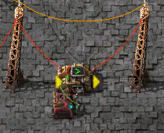
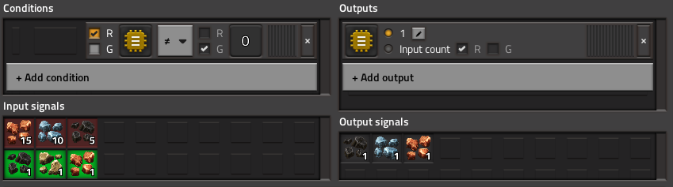

A simple circuit design to filter a big circuit network down to just some signals of interest

Set the desired signals in the constant combinator connected to the green network, then configure the decider combinator:

> For each signal present in green, output how many there are in the red network

## Variations
- The red and green circuit networks can be swapped
- `> 0` can be used as a condition where signals are known to be positive (or if negative signal values should be considered unset)
- The constant combinator can be connected to both red and green inputs to bias the outputs up if you want to ensure there's at least one of everything (requires the inputs to be known to be positive)