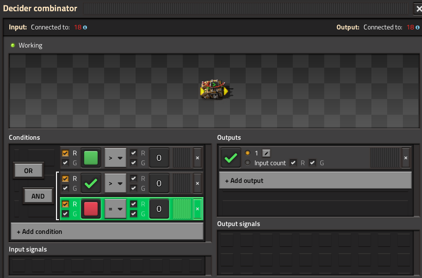

With the output of the decider combinator connected back to the input, it stores the on/off state in the ✅ signal.

Here the green signal is used to turn it on, and the red signal used to turn it off. But for hysterisis, you just put the "turn on condition" where the green one is, and the "stay on condition" (aka NOT "turn off condition") where the red one is.